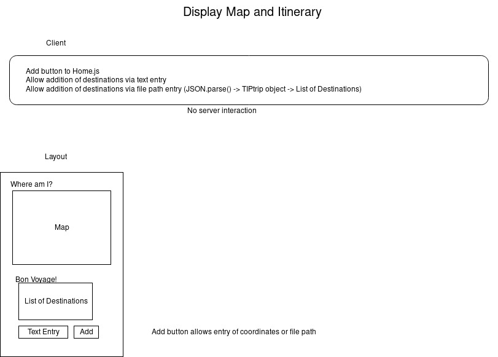
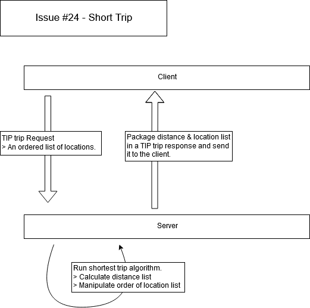

# Sprint 2 - *t18* - *Mongoose*

## Goal

### A map and itinerary!
### Sprint Leader: *Hayden Quintana*

## Definition of Done

* Version in pom.xml should be `<version>2.0.0</version>` for your final build for deployment.
* Increment release `v2.0` created on GitHub with appropriate version number and name.
* Increment deployed for testing and demonstration on SPRINT2 assignment.
* Sprint Review and Restrospectives completed (team/sprint2.md).

## Policies

#### Mobile First Design!
* Design for mobile, tablet, laptop, desktop (in that order).
* Use ReactStrap for a consistent interface (no HTML, CSS, style, etc.).
* Must adhere to the TripCo Interchange Protocol (TIP) for interoperability and testing.
#### Clean Code
* Code Climate maintainability of A or B.
* Code adheres to Google style guides for Java and JavaScript.
#### Test Driven Development
* Write method headers, unit tests, and code in that order.
* Unit tests are fully automated.
#### Configuration Management
* Always check for new changes in master to resolve merge conflicts locally before committing them.
* All changes are built and tested before they are committed.
* All commits include a task/issue number.
* All commits include tests for the added or modified code.
* All tests pass.
#### Continuous Integration / Delivery 
* Master is never broken.  If broken, it is fixed immediately.
* Continuous integration successfully builds and tests all pull requests for master branch.
* All Java dependencies in pom.xml.  Do not load external libraries in your repo. 

## Plan

This sprint will complete the following Epics.

* *#69 where am i: TripCo: Show the user their exact location on the home page map if it is available.*
* *#70 vincenty: TripCo: As a company, we have decided to use the Vincenty formula from https://en.wikipedia.org/wiki/Great-circle_distance with the mean earth radius of 3959 miles from https://en.wikipedia.org/wiki/Earth_radius. This allows us to compare results between the various implementations, particularly when we interoperate.*
* *#71 display map and itinerary: User: I want to be able to load a trip itinerary I obtained from another tool so I can see a map of my trip and an updated itinerary that includes the leg and cumulative distances so I know how far I must travel.*
* *#72 geographic coordinate validation: TripCo: All geographic coordinates should be validated, and invalid formats reported to the user in a user-friendly way so the calculator is easy to use.*
* *#73 geographic coordinate formats: User: I want the distance calculator to support many/all formats for geographic coordinates so I can copy/paste them from any source.*
* *#74 short trip: User: I would like the tool to rearrange my trip for me to make it shorter so I have will have less travel time.*

Key planning decisions for this sprint include mutual distribution of tasks, under criterion of number weighted by percieved difficulty. Open communication will need to be held throughout the sprint duration in order to maximize successful integration of different components and keep to the allotted window.

Display Map and Itinerary Epic Diagram

Client Server Diagram for Short Trip Epic

## Metrics

| Statistic | # Planned | # Completed |
| --- | ---: | ---: |
| Epics | *6* | *5* |
| Tasks |  *11*   | *22* | 
| Story Points |  *12*  | *24* | 

## Scrums

| Date | Tasks closed  | Tasks in progress | Impediments |
| :--- | :--- | :--- | :--- |
| *17/09/2019* | *#task, ...* | *#86, #83, #92, #87* | *none* | 
| *18/09/2019* | *#99 | *#86, #83, #92, #87, #96, #101, #102* | *none* |
| *20/09/2019* | *#103 | *#86, #83, #92, #87, #96, #101, #102, #105* | *none* |
| *24/09/2019* | *#86* | *#83, #92, #87, #96, #101, #102, #105* | *none* | 
| *25/09/2019* | ** | *#83, #92, #87, #96, #101, #102, #105* | *none* | 
| *26/09/2019* | *104* | *#83, #92, #87, #96, #101, #102, #105* | *none* | 
| *28/09/2019* | *105, 108* | *#83, #92, #87, #96, #101, #102* | *none* | 
| *29/09/2019* | *84, 85, 93, 110, 112, 119, 120* | *#83, #92, #87, #96, #101, #102* | *none* |
| *30/09/2019* | *113, 115, 116, 117, 118* | *#83, #92, #87, #96, #101, #102* | *none* |
| *1/10/2019* | *71, 92, 121, 126, 128* | *#83, #87, #96, #101, #102* | *none* |
| *2/10/2019* | *101, 102, 134* | *#83, #87, #96* | *none* |
| *3/10/2019* | *57, 69, 70, 73, 88, 114, 141, 148* | ** | *none* |

## Review (focus on solution and technology)

In this sprint, we have begun to familiarize our team with the methodology necessary for integrated work, as well as how our team can work in tandem using the various networking options available to us.

#### Completed epics in Sprint Backlog 

These Epics were completed.

* *#69 Where Am I: comments*
* *#70 Vincenty: comments*
* *#71 Display map and itinerary: comments*
* *#72 Geographic Coordinate Validation: comments*
* *#72 Geographic Coordinate Formats: comments*

#### Incomplete epics in Sprint Backlog 

These Epics were not completed.

* *#74 short trip: explanation*

#### What went well

Collectively were able to better estimate the length and complexity of assigned epics and subsequent tasks.
Were able to more effectively communicate and meet as a team.
Began to improve comprehension of resources, javascript, and java.
Learning to write more comprehensive, efficient, and effective tests.

#### Problems encountered and resolutions

Underestimated the time required to finish tasks, as well as the time able to be devoted to tasks.

## Retrospective (focus on people, process, tools)

In this sprint, we began to familiarize ourselves with intelliJ and the languages associated with the repository and its components.
We completed most of the epics that we expected to be able to.

#### What we changed this sprint

Our changes for this sprint included being able to implement more complex functionality, and writing cleaner code.

#### What we did well

We began to teach and support each other when struggling, as well as having the willingness to ask for help when necessary.

#### What we need to work on

We could improve working as a more cohesive unit, as well as beginning tasks earlier and working on consecutively smaller pieces.

#### What we will change next sprint 

We will change how early we begin working on the epics, as well as breaking each epic down to smaller, more managable portions.
