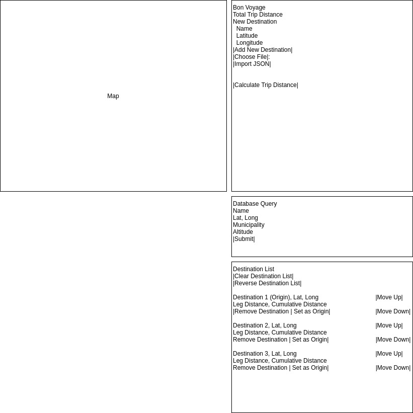
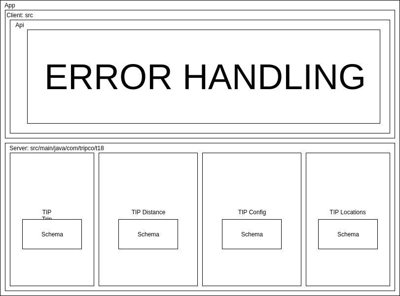

# Sprint 3 - *T18* - *THE FIGHTING MONGOOSES*

## Goal

### Shorter trips to more places!
### Sprint Leader: *Long Chen*

## Definition of Done

* Version in pom.xml should be `<version>3.0</version>` for your final build for deployment.
* Increment release `v3.0` created on GitHub with appropriate version number and name.
* Increment `server-3.0.jar` deployed for testing and demonstration on SPRINT3 assignment.
* Sprint Review, Restrospective, and Metrics completed (team/sprint3.md).

## Policies

#### Mobile First Design!
* Design for mobile, tablet, laptop, desktop (in that order).
* Use ReactStrap for a consistent interface (no HTML, CSS, style, etc.).
* Must adhere to the TripCo Interchange Protocol (TIP) for interoperability and testing.
#### Clean Code
* Code Climate maintainability of A or B.
* Code adheres to Google style guides for Java and JavaScript.
#### Test Driven Development
* Write method headers, unit tests, and code in that order.
* Unit tests are fully automated.
* Code Coverage above 40%
#### Configuration Management
* Always check for new changes in master to resolve merge conflicts locally before committing them.
* All changes are built and tested before they are committed.
* All commits include a task/issue number.
* All commits include tests for the added or modified code.
* All tests pass.
#### Continuous Integration / Delivery 
* Master is never broken.  If broken, it is fixed immediately.
* Continuous integration successfully builds and tests all pull requests for master branch.
* All Java dependencies in pom.xml.  Do not load external libraries in your repo. 

## Plan

This sprint will complete the following Epics.

* *#162 Tip V3: TripCo The server must support the TIP version 3 specification.*
* *#74 Short trip: User: I would like the tool to rearrange my trip for me to make it short so I have will have less travel time.
                  Use the nearest-neighbor construction algorithm to build a shorter trip.
                  Pick the shortest of the possible trips starting from each possible location.
                  Show the resulting trip starting from the original starting location.*
* *#75 save trip: User: Let me save the trip to a file in different formats for different purposes.
                  TIP JSON so I can load it into compatible tools
                  CSV so I can load it into a spreadsheet*
* *#76 api validation: TripCo: To ensure interoperability:
                   servers should validate all Restful API requests they receive. If the request is not valid, the server should respond with the offending request and an HTTP status code of 400 to signify there was an error in the request sent to the server.
                   clients should validate all Restful API responses they receive. If the response is not valid, the client should notify the user.
                   use JSON schemas for the validation.*
* *#78 modify trip: User: Let me modify my trip as I change my mind about my travels. I should be able to:
                   add new destinations by entering them
                   select new destinations from data source(s) like a database
                   remove existing destinations
                   rearrange the order of the locations
                   reverse the order of the locations
                   choose a new starting location*
  
*

***Key planning decisions for this sprint3: 
    1: We discussed the 5 required epics, which is main goal for this sprint
    2: We distributed the 5 epics to 24 tasks
    3: Each teammate chose some epics or tasks
    4: We also talked about bugs from previous sprint
    5: We also want to do some tests for many implications***

Modify Trip Diagram

## Metrics

| Statistics | Planned | Completed |
| --- | ---: | ---: |
| Epics | *5* | *value* |
| Tasks |  *24*   | *value* | 
| Story Points |  *27*  | *value* | 

## Scrums

| Date | Tasks closed  | Tasks in progress | Impediments |
| :--- | :--- | :--- | :--- |
| *10/08/2019* | *#159, #181, #179, #189, #182* | *#186, #177, #188, #158* | *none* | 
| *10/09/2019* | *#195* | *#186, #158, #171, #188, #196, #177* | *none* | 
| *10/10/2019* | *#195* | *#186, #158, #171, #188, #196, #177* | *none* |
| *10/11/2019* | *none* | *#186, #158, #171, #188, #196, #177, #199* | *none* |
| *10/14/2019* | *#199, #198, #188* | *#171, #196, #158, #188, #177, #186* | *none* |
| *10/15/2019* | *#206, #208, #201, #196, #197, #171, #202, #203, #207, #158, #209, #211, #210* | *#204, #213, #177, #186, #173* | *none* |
| *10/16/2019* | *#215, #210, #198, #188* | *#204, #213, #177, #186, #173* | *none* |
| *10/17/2019* | *#200, #214, #213, #173, #217* | *#175, #177, #186* | *none* |
| *10/18/2019* | *#226* | *#175, #177, #186, #225, #224, #227, #223, #172* | *none* |
| *10/21/2019* | *#222, #221, #217, #219, #225, #227* | *#218, #175, #186, #177, #224, #223, #216* | *none* |
| *10/22/2019* | *#175, #232, #193* | *#218, #186, #177, #224, #223, #216* | *none* |
| *10/23/2019* | *#225, #227* | *#235, #191, #177, #186, #184* | *none* |

## Review (focus on solution and technology)

We completed all of our epics. We learned how to use GitHub better, and learned to use all of the 
new programming tools used in this sprint.

#### Completed epics in Sprint Backlog 

These Epics were completed.

* *## epic title: comments*
* Tip V3
* Validate API
* Short Trip
* Save Trip
* Modify Trip

#### Incomplete epics in Sprint Backlog 

These Epics were not completed.

* *## epic title: explanation*
* 

#### What went well

We got all of our planned epics done. We where much better at planning this epic than last sprint, our estimation
of the work involved was much more accurate.

#### Problems encountered and resolutions

The instructions provided for implementing the validation schemas were difficult to interpret. The solution was
several hours of research. Github also presented an interesting last minute problem, insisting that a branch
that was merged with master was the same as master in spite of the fact that it very obviously had not correctly
merged and had differences.

## Retrospective (focus on people, process, tools)

Other than somewhat sparse commits for the first few weeks, we followed the GitHub process well.

#### What we changed this sprint

We got better estimation for breaking down epics into tasks.

#### What we did well

We managed to get all of the epics done for this sprint. We followed the GitHub process well. We communicated and
solved issues individuals were having more effectively as a team.

#### What we need to work on

We need to start working earlier. We need to work on communicating in a more timely and effective manner. We need to 
work on making more regular commits to GitHub.

#### What we will change next sprint 

We will start working earlier. We'll make more regular commits rather than just working locally.
