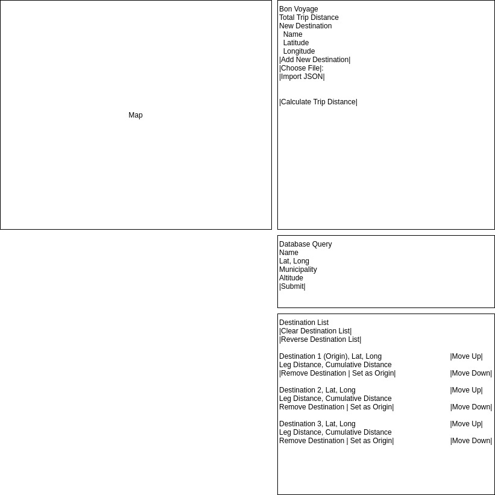

# Sprint 4 - T18 - THE FIGHTING MONGOOSES

## Goal

### Faster trips worldwide!
### Sprint Leader: *James Lounsbury*

## Definition of Done

* Version in pom.xml should be `<version>4.0</version>` for your final build for deployment.
* Increment release `v4.0` created on GitHub with appropriate version number and name.
* Increment `server-4.0.jar` deployed for testing and demonstration on SPRINT4 assignment.
* Sprint Review, Restrospective, and Metrics completed (team/sprint4.md).

## Policies

#### Mobile First Design!
* Design for mobile, tablet, laptop, desktop (in that order).
* Use ReactStrap for a consistent interface (no HTML, CSS, style, etc.).
* Must adhere to the TripCo Interchange Protocol (TIP) for interoperability and testing.
#### Clean Code
* Code Climate maintainability of A (Technical Debt Ratio <= 5).
* Code adheres to Google style guides for Java and JavaScript.
#### Test Driven Development
* Write method headers, unit tests, and code in that order.
* Unit tests are fully automated.
* Code Coverage above 50%
#### Configuration Management
* Always check for new changes in master to resolve merge conflicts locally before committing them.
* All changes are built and tested before they are committed.
* All commits include a task/issue number.
* All commits include tests for the added or modified code.
* All tests pass.
#### Continuous Integration / Delivery 
* Master is never broken.  If broken, it is fixed immediately.
* Continuous integration successfully builds and tests all pull requests for master branch.
* All Java dependencies in pom.xml.  Do not load external libraries in your repo. 

## Plan

This sprint we will complete the following Epics.

* *#263 TIP v4*: Update client and server to be compliant with tip.md v4.0
* *#262 World Wide*: Update SQL Querying to support queries across the world
* *#277 Shorter Trip*: Add a new algorithm to get a shorter trip than the nearest neighbor algorithm
* *#269 Map Clutter*: Add options to remove and change map markers and the trip line
* *#77 Distance Units*: Add new distances for calculations
* *#265 Save Map*: Save map for use in Google Maps and offline

*
***Key planning decisions for this sprint4: 
    1: We discussed the 6 required epics, which is main goal for this sprint
    2: We distributed the 6 epics to 18 tasks
    3: Each teammate chose some epics or tasks
    4: We also talked about updates from previous sprint
    5: We also want to do some tests for many implications***
    
Diagrams

## Metrics

| Statistic | # Planned | # Completed |
| --- | ---: | ---: |
| Epics | 6 | *count* |
| Tasks |  18   | *count* | 
| Story Points |  20  | *count* | 

## Scrums

| Date | Tasks closed  | Tasks in progress | Impediments |
| :--- | :--- | :--- | :--- |
| *10/30/19* | ** | *#298,#305* | *none* | 
| *11/1/19* | *#298,#305* | *none* | *none* | 
| *11/4/19* | *none* | *#296* | *none* | 
| *11/6/19* | *#296* | *#297,#321* | *none* | 
| *11/8/19* | *#297,#321* | *#309* | *none* | 
| *11/11/19* | *#309* | *#268,#270,#271,#301,#302,#311,#326* | *none* | 
| *11/13/19* | *#268,#270,#271,#301,#302,#311,#326* | *#264,#282,#283,#284,#285,#286,#325,#345* | *none* | 
| *11/14/19* | *#264,#282,#283,#284,#285,#286,#325,#345* | ** | *none* | 
 

## Review (focus on solution and technology)

In this sprint, we were unable to finish all of the epics but Map Clutter and Save Map. We also stuggled with the implimentation of many of the features we tried to add. 

#### Completed epics in Sprint Backlog 

These Epics were completed.

* *#263 TIP v4*: Update client and server to be compliant with tip.md v4.0
* *#262 World Wide*: Update SQL Querying to support queries across the world
* *#277 Shorter Trip*: Add a new algorithm to get a shorter trip than the nearest neighbor algorithm
* *#77 Distance Units*: Add new distances for calculations

#### Incomplete epics in Sprint Backlog 

These Epics were not completed.

* *#269 Map Clutter*: we were able to complete most of the Map Clutter Epic but we were unable toggle individual markers on and off. 
* *#265 Save Map*: we were unable to get to the Save map Epic 

#### What went well

This sprint we were able to find abstract solutions to problems that were nebulous to begin with. We came together as a team in order to finish issues which were larger than what an individual could take upon themselves.

#### Problems encountered and resolutions

The problems which we encountered were being able to actively take on other classes while maintaining the process. The resolution was coming together as a team for the final push to the product we have currently.

## Retrospective (focus on people, process, tools)

In this sprint, we've found that we were able to better count on eachother to help solve the problems that the individual could not accomplish alone. We were able to actively find humor in our collective suffering, and thus were able to bolster eachother's resolve to move forward.

#### What we changed this sprint

Our changes for this sprint included how we communicate as a team, how we've chosen to divvy up the issues themselves, and how we know what each person is good at respectively.

#### What we did well

We bonded as a team and were able to help those others which were struggling, as well as shore up the shortcomings we all have with the experience the other teammates have acquired.

#### What we need to work on

We underestimated the difficulty of many of the tasks and need to improve on starting early as a team.

#### What we will change next sprint 

We will be more effective at splitting up epics into more tasks that are of low difficulty and starting earlier. 
